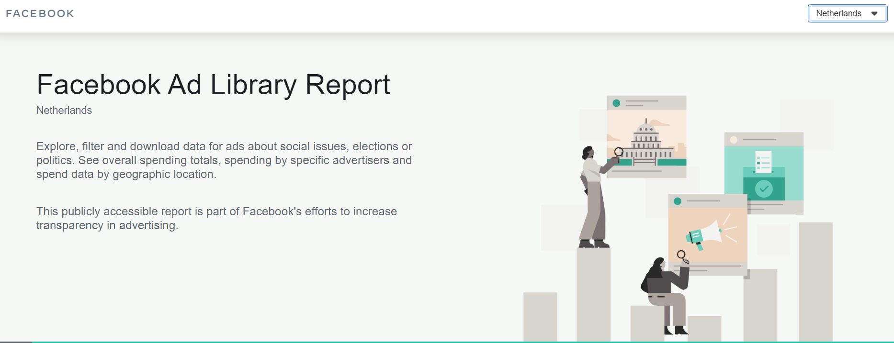

### The PMT Project

The political microtargeting project is multidisciplineary and seeks to scrutinize microtargeting from three point of views:

1. legal
2. ethical
3. empirical/quantitative

--

Two main goals:

1. The design of protocols, guidelines and concrete suggestions for potential regulation of political microtargeting 

2. Create transparency software to make visible character and extent of political microtargeting.

Funding by the *NWO-MVI*

---

### How are Online Poltical Ads used in the Dutch 2021 election?

Creation of a *dashboard* that tracks political advertisement data from Facebook, Google and Snapchat.

Data Sources:

+ Facebook Ad library

+ Google Transparency Report

+ Snapchat Political Ads library (almost no political ads yet)

+ Volunteer data from Who Targets Me Plugin (more about this later)

[Link](https://dashboard.politieke-advertenties.nl/) to dashboard.

---

### What questions are we answering with our dashboard?

There are **four main questions** that we tackle with the current version of our dashboard:

+ How many ads are the Dutch political parties placing on the platforms that we look at?

+ How much money are the parties spending on each platform?

+ How many people are reached through these ads?

+ How are political ads targeted towards individuals?

---

#### How many ads are Dutch parties placing?

Main problem: Ads come in bundles! So how to define a **unique ad**?

---

#### How many ads are Dutch parties placing?

Main problem: Ads come in bundles! So how to define a **unique ad**?

---

#### How many ads are Dutch parties placing?

Why is it important to define a unique ad?

+ Prevent overestimation of number of ads

  + For example, PvDA ran hundreds of different ad ids in one day but only a fraction were unique ads
  
  + PvDA becomes "main producer" of ads in a day but that would be misleading

--

+ For studying different messaging for different groups

--

How to define a unique ad?

Ideal solution: if they use the same text and creative (image or video).

--

Our solution so far: if they use the same description text.

---

#### How much money are the parties spending on each platform?

*Facebook Ad library*

Spending comes in varying boundaries per ad id.

.pull-left[

*It starts with boundaries of 99 [Currency]*

0	- 99			
100 -	199			
200	- 299			
300	- 399			
400	- 499			
500	- 599			
600	- 699			
700	- 799			
800	- 899			
900	- 999

...

]

--

.pull-right[

*But then the ranges increase seemingly arbitrarily*

4500 - 4999			
5000 - 5999			
6000 - 6999

...

150000 - 174999			
175000 - 199999			
200000 - 249999			
600000 - 699999			
1000000+

]

---

#### How much money are the parties spending on each platform?

Solution to the issue: take the median (mid-point) of the boundary?

--

There is another way but it's tricky:

[Facebook Ad Library report](https://www.facebook.com/ads/library/report/)

The Facebook Ad library report has aggregate spending data per advertiser but it's not accessible via the API.

It is not clear why. 

---

#### How many people are reached through these ads?

This metric is often provided as *impressions*. 

An impression is defined as each time an ad appears in a user’s timeline or feed. 

--

+ does not directly translate to how many unique people an ad reached 

+ the same ad can appear many times in a user’s feed

+ even when an ad appears in a newsfeed it does not necessarily mean the user took notice of the ad

--

Also: similar to the spending boundaries discussed earlier impressions are also only given in very broad boundaries.

Solution: in the dashboard we only show the minimum and maximum values but report the mid-point (median) in the tooltip.

---

#### How are political ads targeted towards individuals?

The Facebook Ad library only provides limited information about who saw the advertisements based on 

+ gender
+ age
+ location 

even though far more detailed targeting is possible

--

For every ad, the Facebook ad library provides a "percentage" which relates to the share of the specific demographic or geographic location that has seen the ad. 

--

So, the audience of an ad could show that 20% of the users that have seen the ad were women in the age range of 18-24.   

---

#### How are political ads targeted towards individuals?

There is also the measure of "potential reach".

> `Potential Reach` estimates how many people your ad could potentially reach depending on the targeting and ad placement options you select while creating an ad. ~Facebook Ad Library

.pull-left[
+ 100 - 1.000 individuals reached
+ 1.001 - 5.000
+ 5.001 - 10.000
+ 10.001 - 50.000
+ 50.001 - 100.000
+ 100.001 - 500.000
+ 500.001 - 1 million
+ +1 million
]

.pull-right[
   
   
   
  The smaller the reach the more microtargeted is an advertisement.
]

---

#### How are political ads targeted towards individuals?

*Google Transparency Report*

Per Google, targeting for election ads is limited to “[g]eographic location (except radius around a location), age, and gender.”

--

Different from Facebook, Google provides the targeting criterias selected by the advertisers.

--

It turns out though that very few ads on Google are in fact targeted at all in the Dutch context.

Maybe because Google software (e.g. Google search, YouTube) is not perceived to be a useful avenue for targeting?

---

class: center, middle, inverse

## Who Targets Me study

---

## Who Targets Me Study

.pull-left[

]

.pull-right[

Who Targets Me has developed a browser-plug in that citizens can install

Enables citizens to see who is targeting them with political ads on Facebook 

Who Targets Me software can also be used by researchers and journalists to understand the use of targeted political campaigns

Volunteers from more than 100 countries who have installed Who Targets Me  (ca. 40,000 people, but most from US)

]

---

## Who Targets Me Study

+ Recruiting participants via Facebook ads
  + Ironic, yes
  
+ Volunteers install Who Targets Me app during Dutch election (roughly a month before)

--

+ Provides us with exposure data 

+ In addition on- and offboarding survey:
  + Vote Intention, 
  + Political Knowledge 
  + Affective Polarization

--

+ Once we start collection data we can add more info in the dashboard 
  + for example: WTM Plug-in also scrapes the "Why am I seeing this" label

